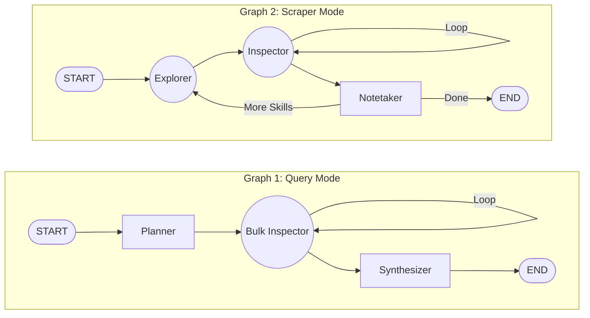
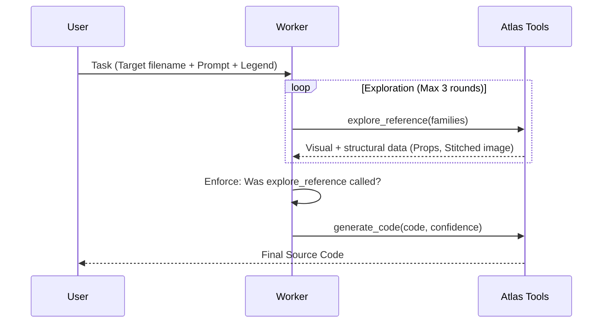
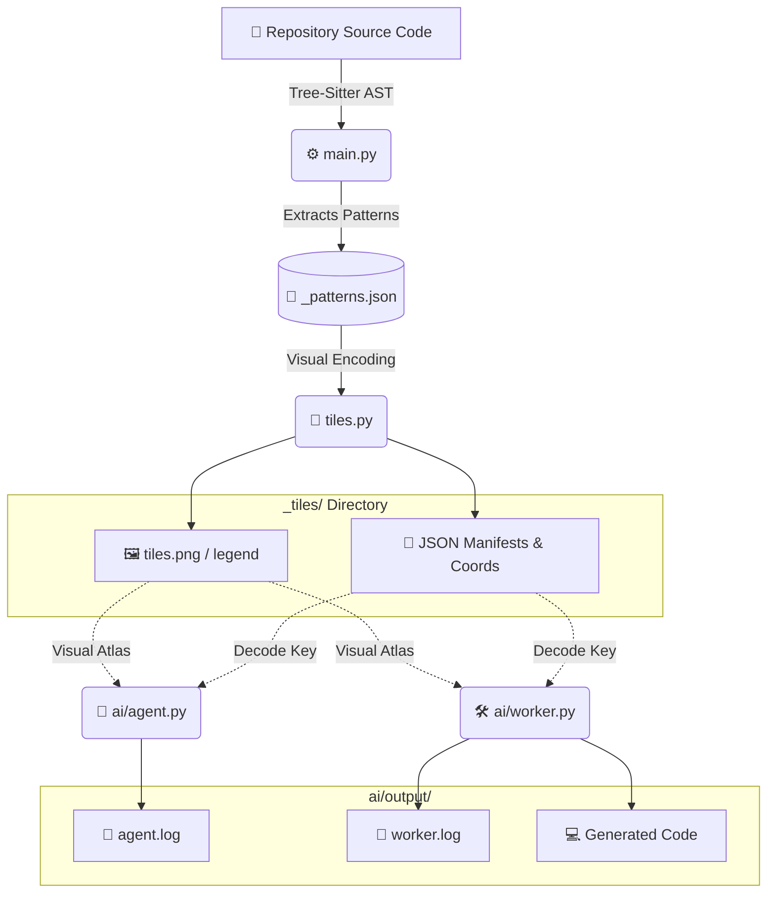

Ah, my apologies! The error happened because Mermaid.js does not allow spaces in **subgraph IDs** (I used `subgraph AI Outputs` instead of `subgraph AI_Outputs`).

Here is the fully corrected Markdown file with completely safe, GitHub-compatible Mermaid diagrams.

---

# 🗜️ Code Base Compressor

> **Codebase Pattern Analyzer & Tile Visualizer**

A powerful two-stage pipeline that analyzes JavaScript/TypeScript repositories, extracts structural usage patterns, and renders them as deterministic pixel-tile images for visual inspection and downstream AI processing.

---

## 📑 Table of Contents

1. [Overview](#-overview)
2. [Stage 1: Pattern Extraction (`main.py`)](#%EF%B8%8F-stage-1--pattern-extraction-mainpy)
3. [Stage 2: Tile Image Rendering (`tiles.py`)](#-stage-2--tile-image-rendering-tilespy)
4. [Stage 3: AI Layer (`ai/`)](#-stage-3--ai-layer-visual-rag--code-generation)
5. [Architecture & Pipeline](#%EF%B8%8F-architecture--full-pipeline)
6. [Requirements & Installation](#-requirements--installation)

---

## 🔭 Overview

The core pipeline consists of two main components, optionally feeding into an advanced AI orchestration layer.

| Component   | File       | Description                                                                    |
| :---------- | :--------- | :----------------------------------------------------------------------------- |
| **Stage 1** | `main.py`  | Scans a repo, extracts AST patterns, and outputs a structured JSON file.       |
| **Stage 2** | `tiles.py` | Consumes the JSON, tokenizes patterns, and renders colorful pixel-tile images. |
| **Stage 3** | `ai/`      | Uses the rendered tiles as a visual Atlas to drive AI query/generation agents. |

---

## ⚙️ Stage 1 — Pattern Extraction (`main.py`)

Scans all `.js`, `.ts`, `.jsx`, `.tsx` source files (excluding build files) in a target repository and extracts the following pattern types:

- 📞 **Call patterns** — Function/method call chains (e.g., `api.getData(...)`)
- ⚛️ **JSX patterns** — Component usage (e.g., `<Button />`)
- 📌 **Constant patterns** — Named constant definitions
- 📦 **Component definitions** — React component definitions with props and return types
- 🏷️ **Type definitions** — TypeScript type/interface declarations
- 🔗 **Reference patterns** — Named identifier references

After extraction, patterns are **grouped, filtered, deduplicated, and cleaned**. The final output is a single JSON file containing all pattern categories, a vocabulary set, and a token count summary (via `tiktoken`).

### Usage

```bash
python main.py --path ./my-repo
```

**CLI Arguments:**

| Flag            | Default                | Description                                   |
| :-------------- | :--------------------- | :-------------------------------------------- |
| `--path`        | `repo`                 | Path to the repository to analyze.            |
| `--output`      | `<repo>_patterns.json` | Output JSON file path.                        |
| `--exclude-dts` | `false`                | Exclude TypeScript `.d.ts` declaration files. |

> **Output:** A `<repo>_patterns.json` file, ready to be consumed by Stage 2.

---

## 🎨 Stage 2 — Tile Image Rendering (`tiles.py`)

Reads the JSON produced by Stage 1 and renders a **visual tile map** where each unique pattern family becomes a colored block of deterministic pixel tiles.

### How Tiles Work

1. **Deterministic Hashing:** Each token family gets a unique color and texture glyph derived from a SHA-256 hash of its name.
   - _Byte 0-2:_ Base RGB Color.
   - _Byte 3:_ Texture pattern (stripes, checkerboard, diagonals, border frame, etc.).
2. **Layout:** Tokens are laid out as 16×16 pixel tiles in rows within labeled blocks.
3. **Canvas Packing:** Blocks are shelf-packed onto a canvas. If the canvas exceeds `max_dimension` (default `10000px`), it splits into multiple image files.
4. **Disambiguation:** A 2×2 corner checksum marker is optionally added to resolve visual collisions.

### Usage & Outputs

```bash
python tiles.py <repo>_patterns.json
```

**Output Directory:** `<repo>_tiles/`

| File                                   | Description                                                   |
| :------------------------------------- | :------------------------------------------------------------ |
| `tiles.png` _(or tiles_1, tiles_2...)_ | Main visual tile image(s).                                    |
| `tiles_legend.png`                     | Visual legend mapping glyph visuals to family names.          |
| `tiles.vocab.json`                     | List of all unique families in the output.                    |
| `tiles.coords.json`                    | Bounding box coordinates for every rendered block.            |
| `tiles.manifest.json`                  | Per-image breakdown of families and image paths.              |
| `tiles.analysis.json`                  | Parent/child relationship analysis between families.          |
| `map.json`                             | Full registry mapping disambiguated names to source metadata. |

### Configuration (`TileConfig` inside `tiles.py`)

| Parameter             | Default        | Description                                        |
| :-------------------- | :------------- | :------------------------------------------------- |
| `tile_size`           | `16`           | Width and height of each tile in pixels.           |
| `pad_family`          | `"PAD"`        | Token name used for padding tiles (solid white).   |
| `sep_family`          | `"SEP"`        | Token name used for separator tiles (solid black). |
| `background`          | `(30, 30, 30)` | Canvas background color.                           |
| `use_checksum_corner` | `True`         | Adds a 2×2 corner marker to each glyph.            |
| `max_dimension`       | `10000`        | Maximum canvas size before image splitting.        |

### Token Disambiguation

Identifiers extracted from the codebase are disambiguated by kind using the `::` notation:

| Suffix     | Meaning                                  |
| :--------- | :--------------------------------------- |
| `::JSX`    | JSX component usage                      |
| `::CALL`   | Function/method call chain               |
| `::CONST`  | Constant definition                      |
| `::DEF`    | Component definition                     |
| `::BORDER` | Internal glyph variant for block borders |

---

## 🤖 Stage 3 — AI Layer: Visual RAG & Code Generation

The `ai/` directory adds an intelligence layer on top of the tile pipeline. It uses the rendered tile images as a **Visual Atlas** to drive two LLM-powered workflows.

### 1. `ai/agent.py` — LangGraph Orchestration

Builds and runs two distinct LangGraph state machines sharing the same node infrastructure.



**Execution:**

```bash
# Query mode
python -m ai.agent --config config.json

# Autonomous scraper mode
python -m ai.agent --config config.json --scrape
```

### 2. `ai/worker.py` — Pattern-Matching Code Generator

A single-task agent (powered by **Gemini 2.5 Flash**) that generates source code by visually studying tile references. It enforces a strict **explore-before-generate** protocol.



---

## 🏗️ Architecture & Full Pipeline



---

## 📦 Requirements & Installation

**Core Dependencies:**

- Python 3.9+
- `Pillow` (Image generation)
- `numpy` (Matrix/Pixel math)
- `tiktoken` (Token counting)
- `tree-sitter` (AST Parsing via `analyzer.core.languages`)

**AI Dependencies:**

- `google-genai`
- `langgraph`
- `langchain-openai`
- `python-dotenv`

### Setup Command

```bash
pip install pillow numpy tiktoken google-genai langgraph langchain-openai python-dotenv
```

### Environment Variables

Create a `.env` file in your root directory:

```env
OPENAI_API_KEY=sk-...
GOOGLE_API_KEY=AIza...
```
